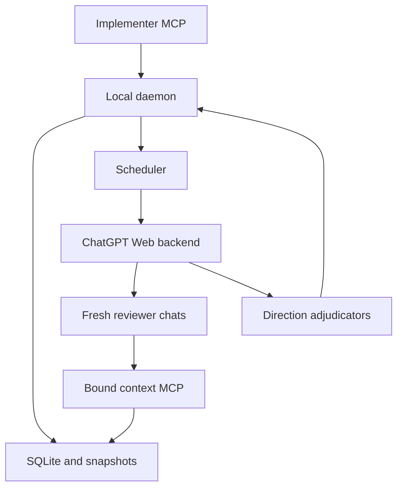

# Архитектура v1

## Два разных контура

Контур разработки: user → lead chat → implementer → PR → reviewer chat → lead → merge. Он действует до появления NightReviewer и описан в [DEVELOPMENT.md](protocols/DEVELOPMENT.md).

Контур продукта: MCP client → локальный daemon → scheduler → backend → runtime workers → direction adjudicators → persisted verdict. Ни lead chat, ни development reviewer не являются зависимостями запуска поставляемого приложения.

## Компоненты

| Компонент | Ответственность | Не делает |
|---|---|---|
| MCP client adapter | Submit/status/fix/cancel; authenticated local RPC к daemon | Не теряет jobs при закрытии stdio клиента |
| Review service | State machine, policy, CAS transitions, audit | Не решает семантическую истинность finding |
| Snapshot/context | Git object reads, manifest, diff/search/read, limits | Не читает mutable working tree и arbitrary filesystem |
| Store | SQLite migrations, attempts, raw artifacts, provenance | Не превращает missing data в пустое успешное review |
| Scheduler | Durable leases, fencing, fair bounded dispatch | Не создаёт новые чаты при неоднозначном send |
| ReviewerBackend | Transport/cancel/capabilities/result envelope | Не хранит бизнес-правила направления |
| Direction adjudicator | Evidence validation, semantic dedup, fix verification | Не выполняет произвольный fresh review во время fix |
| Approval gate | Полнота runs, policy и точный SHA | Не принимает majority vote за доказательство |

Предлагаемые каталоги: `src/protocol`, `src/service`, `src/storage`, `src/snapshot`, `src/context`, `src/scheduler`, `src/backends`, `src/mcp`, `src/cli`, `src/prompts`, `tests/fixtures`. NR-01 может упростить структуру, сохраняя границы.

## Backend contract (проект, схемы реализуются NR-03)

`execute(request, abortSignal) → BackendResult`: request содержит immutable run/attempt IDs, role (`reviewer|adjudicator|fix_verifier`), binding handle, prompt/schema hash, model/effort и deadline. Result содержит transport receipt, raw artifact reference/hash, observed model, завершённость и parsed output либо typed error. Binding не сериализует секреты в публичный manifest.

`capabilities()` сообщает реальные доступные функции: fresh sessions, tool loop, cancellation, observed identity, concurrency. Не поддержанное требование даёт CONFIGURATION_ERROR, а не silent fallback. HTTP/SSE response done, browser completion и valid JSON — разные факты, все нужны для успешного run.

## Snapshot design

Detached worktree сам по себе не immutable. Источник истины — сохранённые Git objects для base/head и content-addressed manifest. Context читает blobs по pinned SHA, не через свободный filesystem path. Сохранить reachable objects в owned mirror/pinned refs или self-contained bundle, чтобы GC/source repo deletion не сломали review. Worktree — необязательный cache; symlinks не разыменовываются, submodules/LFS явно отмечены.

## Данные и восстановление

SQLite: `reviews`, `review_cycles`, `snapshots`, `direction_runs`, `worker_attempts`, `worker_attempt_results`, `raw_artifacts`, `raw_findings`, `canonical_findings`, `finding_sources`, `adjudication_decisions`, `fix_submissions`, `finding_verifications`, `events`, `outbox`, `leases`, `idempotency_keys`. `src/storage` использует встроенный `bun:sqlite`: WAL, `synchronous=FULL`, foreign keys и ограниченный busy timeout; каталог принадлежит приложению с mode `0700`, database и artifact files — `0600`.

Миграции 1 и 2 ведутся checksum-реестром. Неизвестная будущая схема, повреждённый ledger и непустая БД без версии отвергаются без downgrade или попытки переписать данные. Перед каждой миграцией существующей версии создаётся и проверяется согласованная резервная копия; первая миграция допустима только для пустой схемы.

Repository API сохраняет review submission и idempotency result одной транзакцией; state reducer NR-03 исполняется внутри `BEGIN IMMEDIATE`, а CAS, event и outbox фиксируются вместе. Fix submission проверяет `expectedVersion` и полный authoritative finding ID set, сохраняет fix и переводит cycle в `VERIFYING_FIX` одной транзакцией. Направление начинает работу при добавлении первой attempt; terminal status разрешён только по допустимому переходу, а `COMPLETE` требует выбранный валидный результат. Fencing token проверяется в транзакциях, которые меняют cycle state.

До parsing caller сохраняет exact response bytes через `persistRawArtifact`; после проверки/разбора он передаёт возвращённую ссылку в `recordWorkerResult`. Bytes попадают во временный файл в принадлежащем приложению content-addressed каталоге, затем fsync и atomic rename публикуют путь `artifacts/sha256/<prefix>/<sha256>`. Только после этого SQLite транзакция связывает точный hash/размер, raw result, provenance и event/outbox. Поэтому падение до commit оставляет обнаруживаемый orphan, но не успешную ссылку на отсутствующий файл. Неуспешный parse сохраняет исходные bytes и disposition. Reconciliation сообщает о orphan, missing, hash/size mismatch и временных файлах; он ничего не удаляет и не повышает orphan до committed записи.

Backup сериализует database и список artifact references в одной read snapshot, нормализует отдельную копию SQLite для read-only проверки и записывает канонический manifest с hashes. Restore сначала проверяет DB integrity, foreign keys и каждый artifact, затем пишет только в новую или пустую папку и повторно сверяет restored store. Автоматическое удаление raw artifacts и downgrade схемы не поддерживаются.

Семантика at-least-once orchestration, idempotent ingest. Exactly-once физическую отправку в браузер не обещаем. После неопределённого send — NEEDS_RECONCILIATION; повтор только после подтверждения отсутствия исходной отправки или явного нового attempt с журналом и исключением старого результата.

## Политика

Default `strict`: correctness/tests/design × 3; общая concurrency 3 для workers и adjudicators. Versioned policy: все confirmed critical/high/medium блокируют; low неблокирующие, но остаются в отчёте. Любой кандидат с unresolved validation, пропавший обязательный run, unknown coverage или malformed completion блокирует APPROVED. Reject finding можно по evidence; одиночное обнаружение не причина rejection. Scope escalation даёт новый cycle с parent link, не бесконечное расширение fix review.
